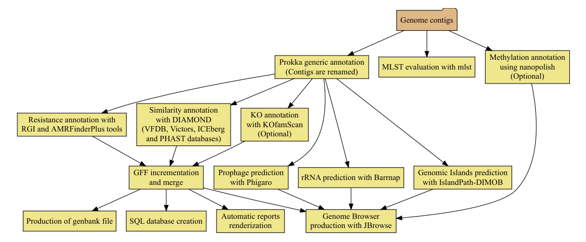

# Bacterial Annotation (bacannot) Pipeline
  

This is an easy to use pipeline that uses state-of-the-art software for prokaryotic genome annotation and has only two dependencies: [Docker](https://www.docker.com/) and [Nextflow](https://github.com/nextflow-io/nextflow). Bacannot pipeline is a nextflow docker-based wrapper around a several tools that enables a better understanding of prokaryotic genomes. It uses [Prokka](https://github.com/tseemann/prokka) for generec annotation, [barrnap](https://github.com/tseemann/barrnap) for rRNA prediction. [mlst](https://github.com/tseemann/mlst) for classification within multilocus sequence types, [KofamScan](https://github.com/takaram/kofam_scan) for KO annotation, [Nanopolish](https://github.com/jts/nanopolish) for methylation annotation, [DIAMOND](https://github.com/bbuchfink/diamond) for sequence similarity searches, [JBrowse](http://jbrowse.org/) for genome browser production, [bedtools](https://bedtools.readthedocs.io/en/latest/) for gene merge, [AMRFinderPlus](https://github.com/ncbi/amr/wiki) and [CARD-RGI](https://github.com/arpcard/rgi) for antimicrobial genes annotation, [Phigaro](https://github.com/bobeobibo/phigaro) and [IslandPath-DIMOB](https://github.com/brinkmanlab/islandpath) for genomic islands prediction.

## Table of contents

* [Requirements](https://github.com/fmalmeida/ngs-preprocess#requirements)
* [Quickstart](https://github.com/fmalmeida/ngs-preprocess#quickstart)
* [Documentation](https://github.com/fmalmeida/ngs-preprocess#documentation)
  * [Full usage](https://github.com/fmalmeida/ngs-preprocess#usage)
  * [Usage Examples](https://github.com/fmalmeida/ngs-preprocess#usage-examples)
  * [Configuration File](https://github.com/fmalmeida/ngs-preprocess#using-the-configuration-file)

## Requirements

* Unix-like operating system (Linux, macOS, etc)
* Java 8
* Docker
  * `fmalmeida/bacannot:{latest, kofamscan, jbrowse, renv}`

This images have been kept separate to not create massive Docker image and to avoid dependencies conflits.

## Quickstart

1. If you don't have it already install Docker in your computer. Read more [here](https://docs.docker.com/).
    * You can give this [in-house script](https://github.com/fmalmeida/bioinfo/blob/master/dockerfiles/docker_install.sh) a try.
    * After installed, you need to download the required Docker images

          docker pull fmalmeida/bacannot:latest
          docker pull fmalmeida/bacannot:kofamscan
          docker pull fmalmeida/bacannot:jbrowse
          docker pull fmalmeida/bacannot:renv

2. Install Nextflow (version 0.24.x or higher):

       curl -s https://get.nextflow.io | bash

3. Give it a try:

       nextflow fmalmeida/bacannot --help

## Documentation

### Usage

Checkout the full usage help with `nextflow run fmalmeida/bacannot --help`

Please take a time to read the [docs](https://bacannot.readthedocs.io/en/latest/?badge=latest).

### Usage examples:

> Simple annotation example through cli

    ./nextflow run main.nf --outDir TESTE --threads 3 --genome assembly.fasta --bedtools_merge_distance -20 --prokka_center UNB --not_run_kofamscan

> Running with a configuration file

    ./nextflow run fmalmeida/bacannot -c nextflow.config

## Using the configuration file

All the parameters showed above can be, and are advised to be, set through the configuration file. When a configuration file is set the pipeline is run by simply executing `nextflow run fmalmeida/bacannot -c ./configuration-file`

Your configuration file is what will tell to the pipeline the type of data you have, and which processes to execute. Therefore, it needs to be correctly set up.

Create a configuration file in your working directory:

      nextflow run fmalmeida/bacannot --get_config

# Citation

    Felipe Marques de Almeida. (2020, January 25). fmalmeida/bacannot: fmalmeida/bacannot: A pipeline for an easy but comprehensive annotation of prokaryotic genomes (Version v1.0). Zenodo. http://doi.org/10.5281/zenodo.3627670

If using this tool, remember to cite the following software:

[Prokka](https://github.com/tseemann/prokka) for generec annotation, [barrnap](https://github.com/tseemann/barrnap) for rRNA prediction. [mlst](https://github.com/tseemann/mlst) for classification within multilocus sequence types, [KofamScan](https://github.com/takaram/kofam_scan) for KO annotation, [Nanopolish](https://github.com/jts/nanopolish) for methylation annotation, [DIAMOND](https://github.com/bbuchfink/diamond) for sequence similarity searches, [JBrowse](http://jbrowse.org/) for genome browser production, [bedtools](https://bedtools.readthedocs.io/en/latest/) for gene merge, [AMRFinderPlus](https://github.com/ncbi/amr/wiki) for antimicrobial genes annotation, [Phigaro](https://github.com/bobeobibo/phigaro) and [VirSorter](https://github.com/simroux/VirSorter) for prophage sequences prediction.
