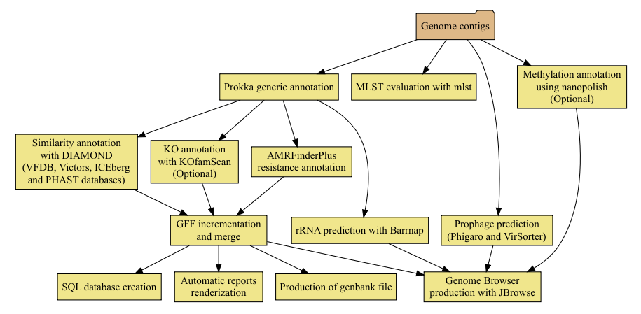

# bacannot pipeline

This is an easy to use pipeline that uses state-of-the-art software for prokaryotic genome annotation and has only two dependencies: [Docker](https://www.docker.com/) and [Nextflow](https://github.com/nextflow-io/nextflow). Bacannot pipeline is a nextflow docker-based wrapper around a several tools that enables a better understanding of prokaryotic genomes. It uses [Prokka](https://github.com/tseemann/prokka) for generec annotation, [barrnap](https://github.com/tseemann/barrnap) for rRNA prediction. [mlst](https://github.com/tseemann/mlst) for classification within multilocus sequence types, [KofamScan](https://github.com/takaram/kofam_scan) for KO annotation, [Nanopolish](https://github.com/jts/nanopolish) for methylation annotation, [DIAMOND](https://github.com/bbuchfink/diamond) for sequence similarity searches, [JBrowse](http://jbrowse.org/) for genome browser production, [bedtools](https://bedtools.readthedocs.io/en/latest/) for gene merge and [AMRFinderPlus](https://github.com/ncbi/amr/wiki) for antimicrobial genes annotation.

Pipeline Fluxogram

## Table of contents

* [Requirements](https://github.com/fmalmeida/ngs-preprocess#requirements)
* [Quickstart](https://github.com/fmalmeida/ngs-preprocess#quickstart)
* [Documentation](https://github.com/fmalmeida/ngs-preprocess#documentation)
  * [Full usage](https://github.com/fmalmeida/ngs-preprocess#usage)
  * [Usage Examples](https://github.com/fmalmeida/ngs-preprocess#usage-examples)
  * [Configuration File](https://github.com/fmalmeida/ngs-preprocess#using-the-configuration-file)

## Requirements

* Unix-like operating system (Linux, macOS, etc)
* Java 8
* Docker
  * `fmalmeida/compgen:PREPROCESS`

## Quickstart

1. If you don't have it already install Docker in your computer. Read more [here](https://docs.docker.com/).
    * You can give this [in-house script](https://github.com/fmalmeida/bioinfo/blob/master/dockerfiles/docker_install.sh) a try.
    * After installed, you need to download the required Docker image

          docker pull fmalmeida/compgen:PREPROCESS

2. Install Nextflow (version 0.24.x or higher):

       curl -s https://get.nextflow.io | bash

3. Give it a try:

       nextflow fmalmeida/ngs-preprocess --help

## Documentation

### Usage

    Usage:
    nextflow run fmalmeida/ngs-preprocess [--help] [ -c nextflow.config ] [OPTIONS] [-with-report] [-with-trace] [-with-timeline]
    Obs: If you have downloaded the files and you run as ./main.nf you must ALWAYS keep the nextflow.config file in the same dir of main.nf

    Comments:
    This pipeline contains a massive amount of configuration variables and its usage as CLI parameters would
    cause the command to be huge.

    Therefore, it is extremely recommended to use the nextflow.config configuration file in order to make
    parameterization easier and more readable.

    Creating a configuration file:
    nextflow run fmalmeida/ngs-preprocess [--get_illumina_config] [--get_ont_config] [--get_pacbio_config]

    Show command line examples:
    nextflow run fmalmeida/ngs-preprocess --examples

    Execution Reports:
    nextflow run fmalmeida/ngs-preprocess [ -c nextflow.config ] -with-report
    nextflow run fmalmeida/ngs-preprocess [ -c nextflow.config ] -with-trace
    nextflow run fmalmeida/ngs-preprocess [ -c nextflow.config ] -with-timeline

    OBS: These reports can also be enabled through the configuration file.

    OPTIONS:

         General Parameters - Mandatory

       --outDir <string>                      Output directory name
       --threads <int>                        Number of threads to use
       --run_shortreads_pipeline              Selects preprocess pipeline of Illumina short reads
       --run_longreads_pipeline               Selects preprocess pipeline of ONT or Pacbio long reads

         Short Reads Parameters - Mandatory if --run_shortreads_pipeline is used

       --shortreads <string>                  String Pattern to find short reads. Example: SRR6307304_{1,2}.fastq
       --reads_size <int>                     Tells wheter input is unpaired or paired end. 1 is unpaired. 2 is paired
       --clip_r1 <int>                        Number of bases to always remove from 5' of read pair 1 or from unpaired read. [Default: 0]
       --clip_r2 <int>                        Number of bases to always remove from 5' of read pair 2. [Default: 0]
       --three_prime_clip_r1 <int>            Number of bases to always remove from 3' of read pair 1 or from unpaired read. [Default: 0]
       --three_prime_clip_r2 <int>            Number of bases to always remove from 3' of read pair 2. [Default: 0]
       --quality_trim <int>                   Phred quality threshold for trimming. [Default: 20]
       --lighter_execute                      Tells wheter to run or not Lighter correction tool
       --lighter_kmer <int>                   Lighter k-mer to use in correction step. [Default: 21]
       --lighter_genomeSize <int>             Approximate genome size
       --lighter_alpha <float>                Lighter sample rate alpha parameter. Rule of thumb: (7/C) where C is coverage.
                                              If not set, Lighter will automatically calculate the best value
       --flash_execute                         If set, PEAR will be executed to merge paired end reads

         Long Reads Parameters - Mandatory if --run_shortreads_pipeline is used

       --lreads_type <string>                 Tells wheter input is from pacbio or ONT. Possibilities: pacbio | nanopore
       --longReads <string>                   Path to pacbio or ONT basecalled reads. If reads are already basecalled, the
                                              pipeline will only check sequencing quality and statistics with NanoPack
       --lreads_is_barcoded                   Tells wheter your data is barcoded or not. It will split barcodes into single files.
                                              Users with legacy pacbio data need to first produce a new barcoded_subreads.bam file.

         For Oxford Nanopore Data - Mandatory if --lreads_type nanopore

       --nanopore_prefix <string>             Output prefix

         For PacificBiosciences Data - Mandatory if --lreads_type pacbio

       --pacbio_bamPath <string>              Path to Pacbio subreads.bam. Only used if user wants to basecall subreads.bam to FASTQ.
                                              Always keep subreads.bam and its relative subreads.bam.pbi files in the same directory
       --pacbio_h5Path <string>               Path to legacy \*.bas.h5 data. It will be used to extract reads in FASTQ file.
                                              All related \*bas.h5 and \*bax.h5 files MUST be in the SAME dir.

### Usage examples:

> Illumina paired end reads. Since it will always be a pattern match, example "illumina/SRR9847694_{1,2}.fastq.gz", it MUST ALWAYS be double quoted as the example below.

    ./nextflow run fmalmeida/ngs-preprocess --threads 3 --outDir outputs/illumina_paired --run_shortreads_pipeline --shortreads \
    "illumina/SRR9847694_{1,2}.fastq.gz" --reads_size 2 --lighter_execute --lighter_genomeSize 4600000 --clip_r1 5 --three_prime_clip_r1 5 \
    --clip_r2 5 --three_prime_clip_r2 5 --quality_trim 30 --flash_execute

> Illumina single end reads. Multiple files at once, using fixed number of bases to be trimmed. If multiple unpaired reads are given as input at once, pattern MUST be double quoted: "SRR9696*.fastq.gz"

    ./nextflow run fmalmeida/ngs-preprocess --threads 3 --outDir sample_dataset/outputs/illumina_single --run_shortreads_pipeline \
    --shortreads "sample_dataset/illumina/SRR9696*.fastq.gz" --reads_size 1 --clip_r1 5 --three_prime_clip_r1 5

> ONT reads (fastq)

    ./nextflow run fmalmeida/ngs-preprocess --threads 3 --outDir sample_dataset/outputs/ont --run_longreads_pipeline --lreads_type nanopore --longReads sample_dataset/ont/kpneumoniae_25X.fastq --nanopore_prefix kpneumoniae_25X

> Pacbio basecalled (.fastq) reads with nextflow general report

    ./nextflow run fmalmeida/ngs-preprocess --threads 3 --outDir sample_dataset/outputs/pacbio_from_fastq --run_longreads_pipeline --lreads_type pacbio --longReads sample_dataset/pacbio/m140905_042212_sidney_c100564852550000001823085912221377_s1_X0.subreads.fastq -with-report

> Pacbio raw (subreads.bam) reads

    ./nextflow run fmalmeida/ngs-preprocess --threads 3 --outDir sample_dataset/outputs/pacbio --run_longreads_pipeline --lreads_type pacbio --pacbio_bamPath sample_dataset/pacbio/m140905_042212_sidney_c100564852550000001823085912221377_s1_X0.subreads.bam

> Pacbio raw (legacy .bas.h5 to subreads.bam) reads

    ./nextflow run fmalmeida/ngs-preprocess --threads 3 --outDir sample_dataset/outputs/pacbio --run_longreads_pipeline --lreads_type pacbio --pacbio_h5Path sample_dataset/pacbio/m140912_020930_00114_c100702482550000001823141103261590_s1_p0.1.bas.h5

## Using the configuration file

All the parameters showed above can be, and are advised to be, set through the configuration file. When a configuration file is set the pipeline is run by simply executing `nextflow run fmalmeida/ngs-preprocess -c ./configuration-file`

Your configuration file is what will tell to the pipeline the type of data you have, and which processes to execute. Therefore, it needs to be correctly set up.

Create a configuration file in your working directory:

* For Illumina data:

      nextflow run fmalmeida/ngs-preprocess --get_illumina_config

* For Pacbio data:

      nextflow run fmalmeida/ngs-preprocess --get_pacbio_config

* For ONT data:

      nextflow run fmalmeida/ngs-preprocess --get_ont_config

# Citation

Cite this tool as:

      Felipe Marques de Almeida. (2019, September 19). fmalmeida/ngs-preprocess: A pipeline for preprocessing NGS data from multiple sequencing platforms (Version V1.0). Zenodo. http://doi.org/10.5281/zenodo.3451406

Users are encouraged to cite the programs used in this pipeline whenever they are used. They are: [FastQC](https://www.bioinformatics.babraham.ac.uk/projects/fastqc/), [TrimGalore](https://github.com/FelixKrueger/TrimGalore), [FLASH](https://ccb.jhu.edu/software/FLASH/), [Lighter](https://github.com/mourisl/Lighter), [Porechop](https://github.com/rrwick/Porechop), [pbh5tools](https://github.com/PacificBiosciences/pbh5tools/blob/master/doc/index.rst), [bam2fastq](https://github.com/PacificBiosciences/bam2fastx) and [NanoPack](https://github.com/wdecoster/nanopack).
