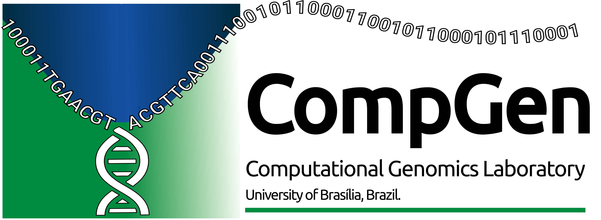

[](https://doi.org/10.12688/f1000research.139488.1)
[](https://github.com/fmalmeida/bacannot/releases)
[](https://bacannot.readthedocs.io/en/latest/?badge=latest)
[](https://www.nextflow.io/)
[](https://www.docker.com/)
[](https://sylabs.io/docs/)
[](https://github.com/fmalmeida/bacannot/blob/master/LICENSE)
[](https://twitter.com/fmarquesalmeida)
[](https://doi.org/10.5281/zenodo.3627669)

[](https://gitpod.io/github.com/fmalmeida/bacannot)

<p align="center">

  <h1 align="center">bacannot pipeline</h2>

  <p align="center">
    <h3 align="center">A generic but comprehensive bacterial annotation pipeline</h3>
    <br />
    <a href="https://bacannot.readthedocs.io/en/latest/index.html"><strong>See the documentation »</strong></a>
    <br />
    <br />
    <a href="https://github.com/fmalmeida/bacannot/issues">Report Bug</a>
    ·
    <a href="https://github.com/fmalmeida/bacannot/issues">Request Feature</a>
  </p>
</p>

## About

Bacannot is an easy to use nextflow docker-based pipeline that adopts state-of-the-art software for prokaryotic genome annotation. It is a wrapper around several tools that enables a better understanding of prokaryotic genomes.

Its main steps are:

| Analysis steps | Used software or databases |
| :------------- | :------------------------- |
| Genome assembly (if raw reads are given) | [Flye](https://github.com/fenderglass/Flye) and [Unicycler](https://github.com/rrwick/Unicycler) |
| Identification of closest 10 NCBI Refseq genomes | [RefSeq Masher](https://github.com/phac-nml/refseq_masher) |
| Generic annotation and gene prediction | [Prokka](https://github.com/tseemann/prokka) or [Bakta](https://github.com/oschwengers/bakta) |
| rRNA prediction | [barrnap](https://github.com/tseemann/barrnap) |
| Classification within multi-locus sequence types (STs) | [mlst](https://github.com/tseemann/mlst) |
| KEGG KO annotation and visualization | [KofamScan](https://github.com/takaram/kofam_scan) and [KEGGDecoder](https://github.com/bjtully/BioData/tree/master/KEGGDecoder) |
| Annotation of secondary metabolites | [antiSMASH](https://docs.antismash.secondarymetabolites.org/) |
| Methylation annotation | [Nanopolish](https://github.com/jts/nanopolish) |
| Annotation of antimicrobial (AMR) genes | [AMRFinderPlus](https://github.com/ncbi/amr/wiki), [ARGminer](https://bench.cs.vt.edu/argminer), [Resfinder](https://cge.cbs.dtu.dk/services/ResFinder/) and [RGI](https://github.com/arpcard/rgi) |
| Annotation of virulence genes | [Victors](http://www.phidias.us/victors/) and [VFDB](http://www.mgc.ac.cn/VFs/main.htm) |
| Prophage sequences and genes annotation | [PHASTER](http://phast.wishartlab.com/), [Phigaro](https://github.com/bobeobibo/phigaro) and [PhySpy](https://github.com/linsalrob/PhiSpy) |
| Annotation of integrative and conjugative elements | [ICEberg](http://db-mml.sjtu.edu.cn/ICEberg/) |
| Annotation of bacterial integrons | [Integron Finder](https://github.com/gem-pasteur/Integron_Finder) |
| Focused detection of insertion sequences | [digIS](https://github.com/janka2012/digIS) |
| _In silico_ detection and typing of plasmids | [Plasmidfinder](https://cge.cbs.dtu.dk/services/PlasmidFinder/), [Platon](https://github.com/oschwengers/platon) and [MOB-typer](https://github.com/phac-nml/mob-suite)|
| Prediction and visualization of genomic islands | [IslandPath-DIMOB](https://github.com/brinkmanlab/islandpath) and [gff-toolbox](https://github.com/fmalmeida/gff-toolbox) |
| Custom annotation from formatted FASTA or NCBI protein IDs | [BLAST](https://blast.ncbi.nlm.nih.gov/Blast.cgi?PAGE_TYPE=BlastDocs) |
| Merge of annotation results | [bedtools](https://bedtools.readthedocs.io/en/latest/) |
| Genome Browser renderization | [JBrowse](http://jbrowse.org/) |
| Circos plot generation | [easy_circos](https://easy_circos.readthedocs.io/en/latest/index.html) |
| Renderization of automatic reports and shiny app for results interrogation | [R Markdown](https://rmarkdown.rstudio.com/), [Shiny](https://shiny.rstudio.com/) and [SequenceServer](https://sequenceserver.com/) |

🎯 In order to increase the accuracy of prokka annotation, this pipeline includes an additional HMM database to prokka's defaults. It can be either TIGRFAM (smaller but curated) or PGAP (bigger comprehensive NCBI database that contains TIGRFAM).

### Release notes

Are you curious about changes between releases? See the [changelog](markdown/CHANGELOG.md).

* I **strongly**, **vividly**, **mightily** recommend the usage of the latest versions hosted in master branch, which is nextflow's default.
    + The latest will always have support, bug fixes and generally maitain the same processes (I mainly add things instead of removing) that also were in previous versions.
    + But, if you **really** want to execute an earlier release, please [see the instructions for that](markdown/earlier_releases_instructions.md).
* Versions below 2.0 are no longer supported.

### Further reading and complementary analyses

Moreover, this pipeline has two complementary pipelines (also written in nextflow) for [NGS preprocessing](https://github.com/fmalmeida/ngs-preprocess) and [Genome assembly](https://github.com/fmalmeida/MpGAP) that can give the user a more thorough and robust workflow for bacterial genomics analyses.

## Requirements

* Unix-like operating system (Linux, macOS, etc)
  + Windows users maybe can execute it using the linux subsystem for windows as shown in:
    + https://docs.microsoft.com/pt-br/windows/wsl/install-win10
    + https://www.nextflow.io/docs/latest/getstarted.html
    + https://en.wikipedia.org/wiki/Windows_Subsystem_for_Linux
* Java 8
* [Nextflow](https://www.nextflow.io/)
* [Docker](https://docs.docker.com/get-docker/)

These images have been kept separate to not create massive Docker image and to avoid dependencies conflicts.

## Installation

1. If you don't have it already install either [Docker](https://docs.docker.com/) or [Singularity](https://docs.sylabs.io/guides/3.5/user-guide/index.html) in your computer.

2. Install Nextflow (version 20.10 or higher):

       curl -s https://get.nextflow.io | bash

3. Give it a try:

       nextflow run fmalmeida/bacannot -profile docker --help

🔥 To run the pipeline now users **need** to pass the `-profile docker` or `-profile singularity` parameter explicitly. The pipeline does not load it automatically anymore.

🔥 Users can get let the pipeline always updated with: `nextflow pull fmalmeida/bacannot`

<a href="https://bacannot.readthedocs.io/en/latest/installation"><strong>Please refer to the installation page, for a complete guide on required images and databases. »</strong></a>

## Quickstart

<a href="https://bacannot.readthedocs.io/en/latest/quickstart"><strong>Please refer to the quickstart page »</strong></a>

### Overview of outputs

A nice overview of the output directory structure and the main tools/features produced by the pipeline is provided at https://bacannot.readthedocs.io/en/latest/outputs.

## Documentation

### Usage

<a href="https://bacannot.readthedocs.io/en/latest/index.html"><strong>Users are advised to read the complete documentation »</strong></a>

* Complete command line explanation of parameters:
    + `nextflow run fmalmeida/bacannot --help`

### Command line usage examples

Command line executions are exemplified [in the manual](https://bacannot.readthedocs.io/en/latest/quickstart).

#### Using the configuration file

All the parameters showed above can be, and are advised to be, set through the configuration file. When a configuration file is set the pipeline is run by simply executing `nextflow run fmalmeida/bacannot -c ./configuration-file`

Your configuration file is what will tell to the pipeline the type of data you have, and which processes to execute. Therefore, it needs to be correctly set up.

Create a configuration file in your working directory:

      nextflow run fmalmeida/bacannot --get_config

##### Overwrite container versions with config

The pipeline uses pre-set docker and singularity configuration files to set all the containers and versions of images that should be used by each module in the pipeline.

Although not recommended, one can use these configuration files to change the version of specific tools if desired.

To download these configs one can:

      nextflow run fmalmeida/bacannot --get_docker_config
      nextflow run fmalmeida/bacannot --get_singularity_config

### Interactive graphical configuration and execution

#### Via NF tower launchpad (good for cloud env execution)

Nextflow has an awesome feature called [NF tower](https://tower.nf). It allows that users quickly customise and set-up the execution and configuration of cloud enviroments to execute any nextflow pipeline from nf-core, github (this one included), bitbucket, etc. By having a compliant JSON schema for pipeline configuration it means that the configuration of parameters in NF tower will be easier because the system will render an input form.

Checkout more about this feature at: https://seqera.io/blog/orgs-and-launchpad/

<p align="center">

</p>

#### Via nf-core launch (good for local execution)

Users can trigger a graphical and interactive pipeline configuration and execution by using [nf-core launch](https://nf-co.re/launch) utility. nf-core launch will start an interactive form in your web browser or command line so you can configure the pipeline step by step and start the execution of the pipeline in the end.

```bash
# Install nf-core
pip install nf-core

# Launch the pipeline
nf-core launch fmalmeida/bacannot
```

It will result in the following:

<p align="center">

</p>

<p align="center">

</p>

## Known issues

1. Sometimes when navigating through the shiny parser the reports and JBrowse tabs may still be pointing to old, or just different, samples that have been analysed before and not the actual sample in question. For example, you open the shiny server for the Sample 2, but the reports and JBrowse are showing results of Sample 1. This is caused by the browser's data storages and cookies.
    * To solve this problem user's can just clear the cookies and data cache from the browser.
2. The JBrowse wrapper in the shiny server is not capable of displaying the GC content and methylation plots when available. It can only display the simpler tracks. If the user wants to visualise and interrogate the GC or methylation tracks it must open the JBrowse outside from the shiny server. For that, two options are available:
    * You can navigate to the `jbrowse` directory under your sample's output folder and simply execute `http-server`. This command can be found at: https://www.npmjs.com/package/http-server
    * Or, you can download the [JBrowse Desktop app](https://jbrowse.org/docs/jbrowse_desktop.html) and, from inside the app, select the folder `jbrowse/data` that is available in your sample's output directory.
3. If you face some weird error using v3.1 or v3.2, please, before opening a ticket, try updating your docker images, we had some inconsistencies lately and this may be the source of the issue.
4. If facing an issue with the `BACANNOT:SUMMARY` module, identical or similar to the one reported in issue [[#96]](https://github.com/fmalmeida/bacannot/issues/96), please, before opening a ticket, try updating the python env docker image: `docker pull fmalmeida/bacannot:v3.2_pyenv`. The image has been recently updated to have the latest version of my python scripts, and that may solve the issue. If not, please open another.
5. Sometimes, the `BACANNOT:UNICYCLER` may fail with different, random issues, that does not seem correct, or seem really very random. For example, saying that a read is not available, even though it is there. After some tracing, we realised that the unicycler 0.4.8 installation from conda, and the biocontainer form quay.io is causing this random problem. To solve this issue, please run with a newer version of the tool. This solves the issue in most cases: `--unicycler_version 0.5.0--py310h6cc9453_3`.
    * Because `v3.2` is already tagged and frozen with Zenodo, we will not update it, thus, for this version, using the parameter to overwrite the tool version should be used.
    * In `v3.3`, unicycler version will be defaulted to `0.5.0--py310h6cc9453_3`

## Citation

In order to cite this pipeline, please refer to:

> Almeida FMd, Campos TAd and Pappas Jr GJ. Scalable and versatile container-based pipelines for de novo genome assembly and bacterial annotation. [version 1; peer review: awaiting peer review]. F1000Research 2023, 12:1205 (https://doi.org/10.12688/f1000research.139488.1)

Additionally, archived versions of the pipeline are also found in [Zenodo](https://doi.org/10.5281/zenodo.3627669).

This pipeline uses code and infrastructure developed and maintained by the [nf-core](https://nf-co.re) community, reused here under the [GPLv3](https://github.com/fmalmeida/bacannot/blob/master/LICENSE).

> The nf-core framework for community-curated bioinformatics pipelines.
>
> Philip Ewels, Alexander Peltzer, Sven Fillinger, Harshil Patel, Johannes Alneberg, Andreas Wilm, Maxime Ulysse Garcia, Paolo Di Tommaso & Sven Nahnsen.
>
> Nat Biotechnol. 2020 Feb 13. doi: 10.1038/s41587-020-0439-x.

In addition, users are encouraged to cite the programs used in this pipeline whenever they are used. Links to resources of tools and data used in this pipeline are in [the list of tools](markdown/list_of_tools.md).
