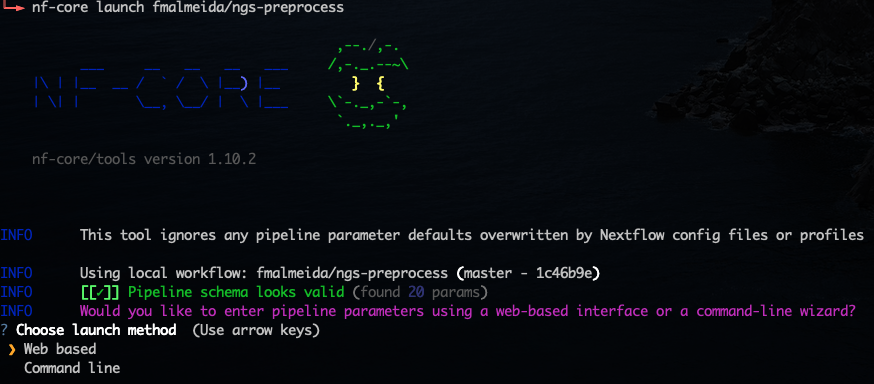
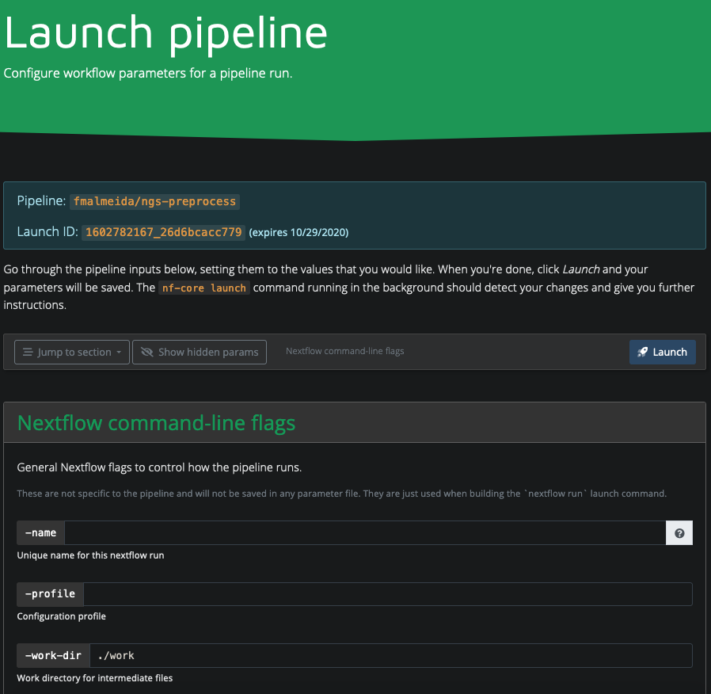

# Bacterial Annotation (bacannot) Pipeline

[](https://doi.org/10.5281/zenodo.3627669)  [](https://travis-ci.com/fmalmeida/bacannot)  [](https://bacannot.readthedocs.io/en/latest/?badge=latest) 

Bacannot is an easy to use nextflow docker-based pipeline that adopts state-of-the-art software for prokaryotic genome annotation. It is a wrapper around a several tools that enables a better understanding of prokaryotic genomes. It uses:

* [Prokka](https://github.com/tseemann/prokka) for generic annotation
* [barrnap](https://github.com/tseemann/barrnap) for rRNA prediction
* [mlst](https://github.com/tseemann/mlst) for classification within multi-locus sequence types (STs)
* [KofamScan](https://github.com/takaram/kofam_scan) for KO annotation
* [KEGGDecoder](https://github.com/bjtully/BioData/tree/master/KEGGDecoder) for drawing KO annotation
* [Nanopolish](https://github.com/jts/nanopolish) for methylation annotation
* [JBrowse](http://jbrowse.org/) for genome browser production
* [bedtools](https://bedtools.readthedocs.io/en/latest/) for annotation merging
* [gff-toolbox](https://github.com/fmalmeida/gff-toolbox) for plotting genomic islands
* [AMRFinderPlus](https://github.com/ncbi/amr/wiki), [ARGminer](https://bench.cs.vt.edu/argminer), [Resfinder](https://cge.cbs.dtu.dk/services/ResFinder/) and [RGI](https://github.com/arpcard/rgi) for antimicrobial genes annotation
* [PHASTER](https://phaster.ca/) database, [Phigaro](https://github.com/bobeobibo/phigaro) and [PhySpy](https://github.com/linsalrob/PhiSpy) for prophage sequences and genes prediction
* [IslandPath-DIMOB](https://github.com/brinkmanlab/islandpath) for genomic islands prediction
* [Plasmidfinder](https://cge.cbs.dtu.dk/services/PlasmidFinder/) and [Platon](https://github.com/oschwengers/platon) for in silico plasmid detection
* [ICEberg](https://academic.oup.com/nar/article/47/D1/D660/5165266) database for the annotation of integrative and conjugative elements
* [Victors](http://www.phidias.us/victors/) and [VFDB](http://www.mgc.ac.cn/VFs/main.htm) for the annotation of virulence genes

## Further reading

This pipeline has two complementary pipelines (also written in nextflow) for [NGS preprocessing](https://github.com/fmalmeida/ngs-preprocess) and [Genome assembly](https://github.com/fmalmeida/MpGAP) that can give the user a complete workflow for bacterial genomics analyses.

## Table of contents

* [Requirements](https://github.com/fmalmeida/bacannot#requirements)
* [Installation](https://github.com/fmalmeida/bacannot#installation)
* [Quickstart](https://github.com/fmalmeida/bacannot#quickstart)
* [Documentation](https://github.com/fmalmeida/bacannot#documentation)
  * [Full usage](https://github.com/fmalmeida/bacannot#usage)
  * [Usage Examples](https://github.com/fmalmeida/bacannot#usage-examples)
  * [Configuration File](https://github.com/fmalmeida/bacannot#using-the-configuration-file)
  * [Interactive and graphical execution](https://github.com/fmalmeida/bacannot#interactive-graphical-configuration-and-execution)
* [Known issues](https://github.com/fmalmeida/bacannot#known-issues)
* [Citation](https://github.com/fmalmeida/bacannot#citation)

## Requirements

* Unix-like operating system (Linux, macOS, etc)
* Java 8
* Docker
  * `fmalmeida/bacannot:{latest, kofamscan, jbrowse, renv}`

This images have been kept separate to not create massive Docker image and to avoid dependencies conflicts.

## Installation

1. If you don't have it already install Docker in your computer. Read more [here](https://docs.docker.com/).
    * You can give this [in-house script](https://github.com/fmalmeida/bioinfo/blob/master/dockerfiles/docker_install.sh) a try.
    * After installed, you need to download the required Docker images

          docker pull fmalmeida/bacannot:latest
          docker pull fmalmeida/bacannot:kofamscan
          docker pull fmalmeida/bacannot:jbrowse
          docker pull fmalmeida/bacannot:renv
          docker pull fmalmeida/bacannot:server (For the shiny parser)
          docker pull fmalmeida/mpgap (Only necessary if using raw reads as input)

    * Each image can be built by using the Dockerfiles in the docker folder

          cd docker
          docker build -t fmalmeida/bacannot:latest -f Dockerfile_bacannot .
          docker build -t fmalmeida/bacannot:kofamscan -f Dockerfile_kofamscan .
          docker build -t fmalmeida/bacannot:jbrowse -f Dockerfile_jbrowse .
          docker build -t fmalmeida/bacannot:renv -f Dockerfile_renv .
          docker build -t fmalmeida/bacannot:server -f Dockerfile_server .

> Each release is accompanied by a Dockerfile in the docker folder. When using older releases, users can create the correct image using
the Dockerfile that goes alongside with the release (Remember to give the image the correct name, as it is in dockerhub and the nextflow script).
The latest release will always have its docker image in dockerhub.

2. Install Nextflow (version 20.07 or higher):

       curl -s https://get.nextflow.io | bash

3. Give it a try:

       nextflow run fmalmeida/bacannot --help

> Users can get let the pipeline always updated with: `nextflow pull fmalmeida/bacannot`

## Quickstart

For a rapid and simple quickstart we will use as input the nanopore raw reads provided in the [Canu quickstart section](https://canu.readthedocs.io/en/latest/quick-start.html#assembling-pacbio-clr-or-nanopore-data).

```bash

  # Download the data and save it as oxford.fasta
  curl -L -o oxford.fasta http://nanopore.s3.climb.ac.uk/MAP006-PCR-1_2D_pass.fasta

  # Run the pipeline using the Escherichia coli resfinder database
  nextflow run fmalmeida/bacannot --prefix ecoli \
  --lreads oxford.fasta \
  --lreads_type nanopore \
  --outdir _ANNOTATION \
  --threads 4 \
  --resfinder_species "Escherichia coli"

```

## Documentation

### Usage

* Complete command line explanation of parameters:
    + `nextflow run fmalmeida/bacannot --help`
* See usage examples in the command line:
    + `nextflow run fmalmeida/bacannot --examples`
* However, users are encouraged to read the [complete online documentation](https://bacannot.readthedocs.io/en/latest/).

### Command line usage examples

Command line executions are exemplified [in the manual](https://bacannot.readthedocs.io/en/latest/examples.html).

## Using the configuration file

All the parameters showed above can be, and are advised to be, set through the configuration file. When a configuration file is set the pipeline is run by simply executing `nextflow run fmalmeida/bacannot -c ./configuration-file`

Your configuration file is what will tell to the pipeline the type of data you have, and which processes to execute. Therefore, it needs to be correctly set up.

Create a configuration file in your working directory:

      nextflow run fmalmeida/bacannot --get_config

### Interactive graphical configuration and execution

Users can trigger a graphical and interactive pipeline configuration and execution by using [nf-core launch](https://nf-co.re/launch) utility.

#### Install nf-core

```bash
# Install nf-core
pip install nf-core
```

#### launch the pipeline

nf-core launch will start an interactive form in your web browser or command line so you can configure the pipeline step by step and start the execution of the pipeline in the end.

```bash
# Launch the pipeline
nf-core launch fmalmeida/bacannot
```

It will result in the following:

<p align="center">

</p>

<p align="center">

</p>

#### nextflow tower

This pipeline also accepts that users track its execution of processes via [nextflow tower](https://tower.nf/). For that users will have to use the parameters `--use_tower` and `--tower_token`.

## Known issues

1. Sometimes when navigating through the shiny parser the reports and JBrowse tabs may still be pointing to old, or just different, samples that have been analysed before and not the actual sample in question. For example, you open the shiny server for the Sample 2, but the reports and JBrowse are showing results of Sample 1. This is caused by the browser's data storages and cookies.
    * To solve this problem user's can just clear the cookies and data cache from the browser.
2. The JBrowse wrapper in the shiny server is not capable of displaying the GC content and methylation plots when available. It can only display the simpler tracks. If the user wants to visualise and interrogate the GC or methylation tracks it must open the JBrowse outside from the shiny server. For that, two options are available:
    * You can navigate to the `jbrowse` directory under your sample's output folder and simply execute `http-server`. This command can be found at: https://www.npmjs.com/package/http-server
    * Or, you can download the [JBrowse Desktop app](https://jbrowse.org/docs/jbrowse_desktop.html) and, from inside the app, select the folder `jbrowse/data` that is available in your sample's output directory.

## Citation

Please cite this pipeline using our Zenodo tag or directly via the github url. Also, whenever used/helpful, remember to cite the following software:

* [Prokka](https://github.com/tseemann/prokka) for generic annotation
* [barrnap](https://github.com/tseemann/barrnap) for rRNA prediction
* [mlst](https://github.com/tseemann/mlst) for classification within multi-locus sequence types (STs)
* [KofamScan](https://github.com/takaram/kofam_scan) for KO annotation
* [KEGGDecoder](https://github.com/bjtully/BioData/tree/master/KEGGDecoder) for drawing KO annotation
* [Nanopolish](https://github.com/jts/nanopolish) for methylation annotation
* [JBrowse](http://jbrowse.org/) for genome browser production
* [bedtools](https://bedtools.readthedocs.io/en/latest/) for annotation merging
* [gff-toolbox](https://github.com/fmalmeida/gff-toolbox) for plotting genomic islands
* [AMRFinderPlus](https://github.com/ncbi/amr/wiki), [ARGminer](https://bench.cs.vt.edu/argminer), [Resfinder](https://cge.cbs.dtu.dk/services/ResFinder/) and [RGI](https://github.com/arpcard/rgi) for antimicrobial genes annotation
* [PHASTER](https://phaster.ca/) database, [Phigaro](https://github.com/bobeobibo/phigaro) and [PhySpy](https://github.com/linsalrob/PhiSpy) for prophage sequences and genes prediction
* [IslandPath-DIMOB](https://github.com/brinkmanlab/islandpath) for genomic islands prediction
* [Plasmidfinder](https://cge.cbs.dtu.dk/services/PlasmidFinder/) and [Platon](https://github.com/oschwengers/platon) for in silico plasmid detection
* [ICEberg](https://academic.oup.com/nar/article/47/D1/D660/5165266) database for the annotation of integrative and conjugative elements
* [Victors](http://www.phidias.us/victors/) and [VFDB](http://www.mgc.ac.cn/VFs/main.htm) for the annotation of virulence genes
