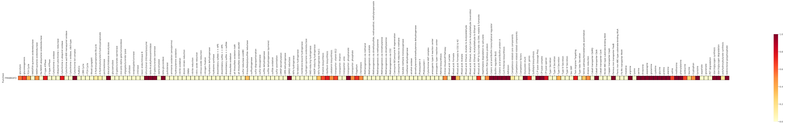
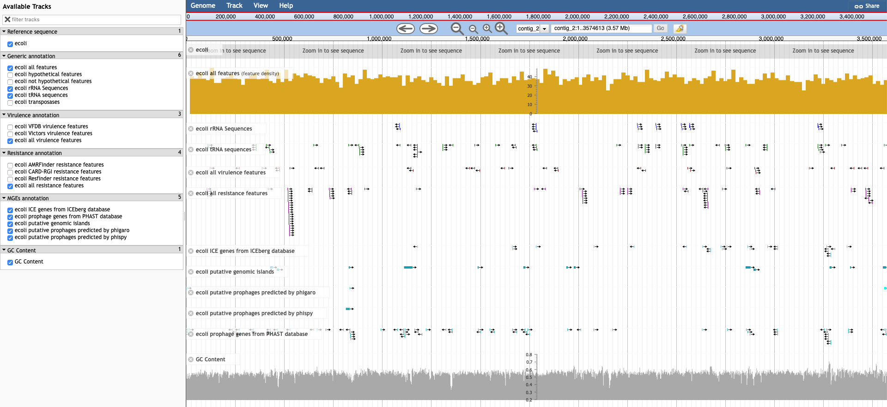
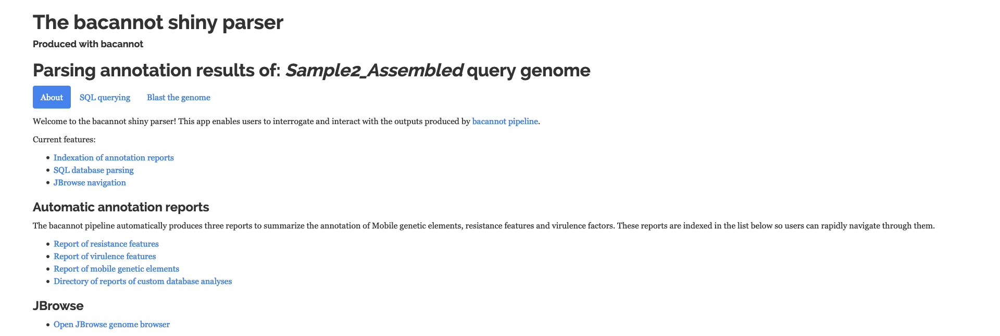
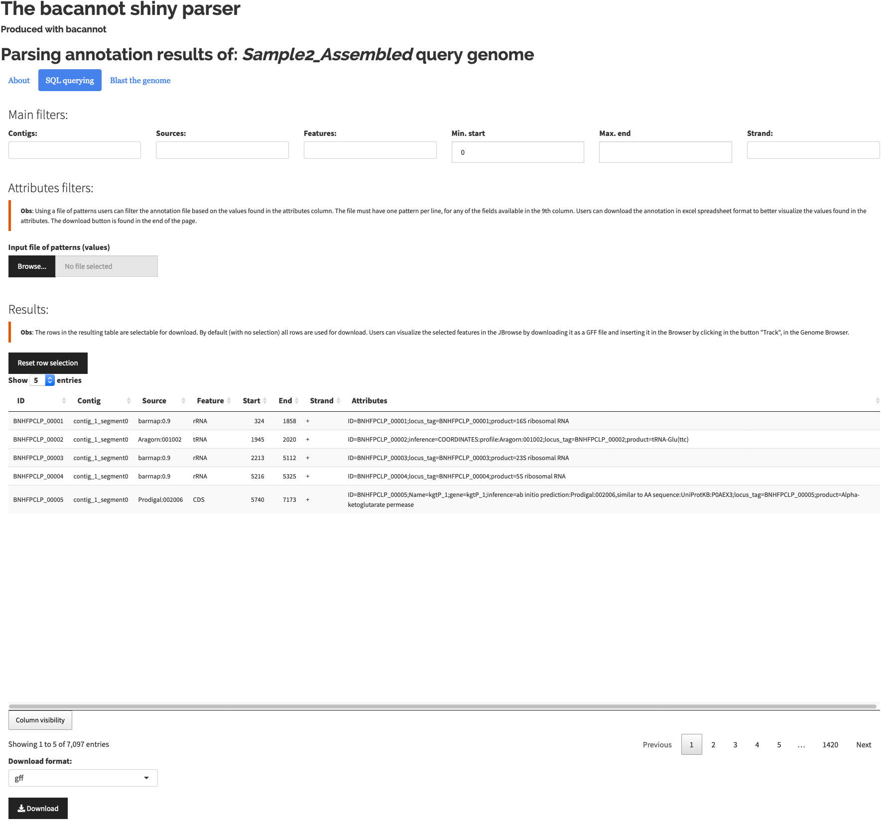
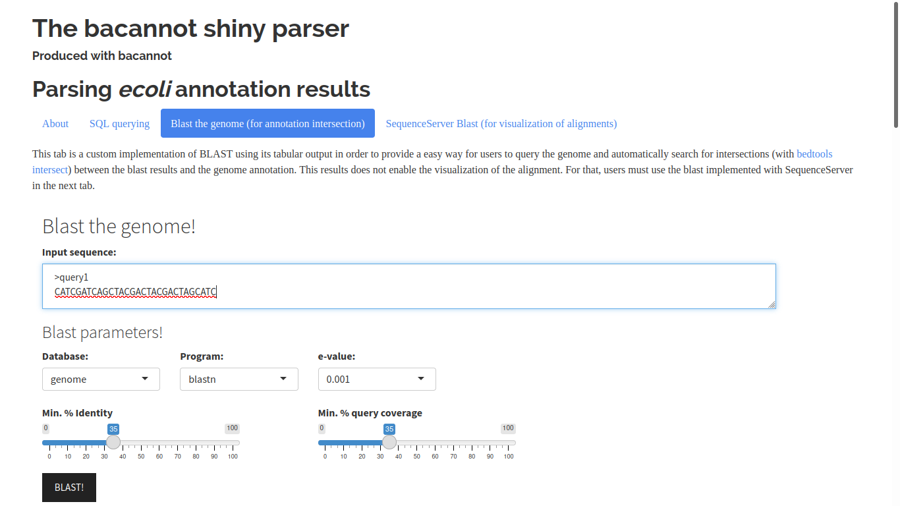

.. _quickstart:

Quickstart
==========

For a rapid and simple quickstart we will use as input the *Escherichia coli* reference genome.

Download the data
-----------------

.. code-block:: bash

  # Download the ecoli ref genome
  wget -O ecoli_ref.fna.gz https://ftp.ncbi.nlm.nih.gov/genomes/all/GCF/000/008/865/GCF_000008865.2_ASM886v2/GCF_000008865.2_ASM886v2_genomic.fna.gz
  gzip -d ecoli_ref.fna.gz

Run the pipeline
----------------

For examplification purposes and to get a major overview we will execute the pipeline's major processes:

.. code-block:: bash

  # Run the pipeline using the Escherichia coli resfinder database
  nextflow run fmalmeida/bacannot \
  --prefix ecoli \
  --genome ecoli_ref.fna \
  --outdir _ANNOTATION \
  --threads 4 \
  --resfinder_species "Escherichia coli"

Outputs
-------

This command shall write the results under the ``_ANNOTATION`` directory.

.. note::

  Please take note that the pipeline uses the directory set with the ``--outdir`` parameter as a storage place in which it will create a folder named as the
  ``--prefix`` parameter. This ``{prefix}`` folder will contain all the results. Therefore the the same ``--outdir`` can be used for different runs/genomes
  as each one of them will have a different sub-folder. This is useful and required for the genomic comparative pipeline (that is under construction) that will
  use this folder as input, and enable the user to rapidly compare the results between the samples under the same ``--outdir`` folder.

Directory tree
^^^^^^^^^^^^^^

After a successful execution, you will have something like this:

.. code-block:: bash

    # Directory tree from the running dir
    .
    ├── _ANNOTATION
    │   └── ecoli
    │       ├── ICEs                                            # Results from ICEberg database annotation
    │       ├── KOfamscan                                       # Results from annotation with KEGG database
    │       ├── MLST                                            # MLST results with mlst pipeline
    │       ├── annotation                                      # Prokka annotation files
    │       ├── assembly                                        # Assembly files (when raw reads are given)
    │       ├── gbk                                             # Gbk file produced from the resulting GFF
    │       ├── genomic_islands                                 # Genomic Islands predicted with IslandPath-DIMOB
    │       ├── gffs                                            # A copy of the main GFF files produced during the annotation
    │       ├── jbrowse                                         # The files that set up the JBrowse genome browser
    │       ├── plasmids                                        # Plasmid annotation results from Platon and Plasmidfinder
    │       ├── prophages                                       # Prophage annotation results from PhiSpy, Phigaro and PHAST
    │       ├── rRNA                                            # barrnap annotation results
    │       ├── report_files                                    # Annotation reports in HTML format
    │       ├── resistance                                      # AMR annotation results from ARGminer, AMRFinderPlus, RGI and Resfinder
    │       ├── sqldb                                           # The sqlDB of the annotation used by the shiny server for rapid parsing
    │       ├── tools_versioning                                # Versions of tools and databases used (whenever available)
    │       ├── virulence                                       # Virulence genes annotation results from Victors and VFDB databases
    │       └── run_server.sh                                   # The shiny parser runner that enables a rapid and simple exploration of the results (see below)
    └── oxford.fasta

KEGG KO annotation heatmap
^^^^^^^^^^^^^^^^^^^^^^^^^^

Using both `KofamScan <https://github.com/takaram/kofam_scan>`_ and `KEGGDecoder <https://github.com/bjtully/BioData/tree/master/KEGGDecoder>`_, bacannot is capable of annotating KOs and plotting a heatmap of detected pathways as exemplified below.

.. tip::

	Click on the image to zoom it! :)

Bacannot automatic reports
^^^^^^^^^^^^^^^^^^^^^^^^^^

Bacannot will use `R Markdown <https://rmarkdown.rstudio.com/>`_ to produce automatic annotation reports. To date, the available reports are:

* Report of Antimicrobial resistance (AMR) genes annotation

  - See `the AMR example report <https://raw.githubusercontent.com/fmalmeida/bacannot/master/docs/reports/report_resistance.html>`_

* Report of virulence genes annotation

  - See `the virulence example report <https://raw.githubusercontent.com/fmalmeida/bacannot/master/docs/reports/report_virulence.html>`_

* Report of mobile genetic elements annotation

  - Including plasmids, prophages, ICEs and genomic islands.
  - See `the MGE example report <https://raw.githubusercontent.com/fmalmeida/bacannot/master/docs/reports/report_MGEs.html>`_

* Report of user's custom db annotations.

  - See :ref:`custom-db`.

Genome Browser
^^^^^^^^^^^^^^

With aid of `JBrowse <http://jbrowse.org/>`_, Bacannot already give users a totally customised and redered Genome Browser for exploration of genome annotation.

In order to provide an integrative solution, the genome browser is already packed inside the shiny app that can be used with the ``run_server.sh`` script or the server docker image (See below at Bacannot shiny parser).

.. warning::

  The JBrowse wrapper in the shiny server is not capable of displaying the GC content and methylation plots when available. It can only display the simpler tracks. If the user wants to visualise and interrogate the GC or methylation tracks it must open the JBrowse outside from the shiny server. For that, two options are available:
    * You can navigate to the ``jbrowse`` directory under your sample's output folder and simply execute `http-server`. This command can be found at: https://www.npmjs.com/package/http-server
    * Or, you can download the `JBrowse Desktop app <https://jbrowse.org/docs/jbrowse_desktop.html>`_ and, from inside the app, select the folder `jbrowse/data` that is available in your sample's output directory.

Bacannot shiny parser
^^^^^^^^^^^^^^^^^^^^^

The bacannot shiny server is basically a wrapper of the main outputs of the pipeline that is packed up in a docker image called ``fmalmeida/bacannot:server``.
This server is triggered by going under the results folder, in our quickstart case, the ``_ANNOTATION/ecoli`` folder, and executing the command:

.. code-block:: bash

  # Trigger the server
  ./run_server.sh -s

  # This will open the pipeline in localhost:3838
  # log message:
  The server has started in: http://localhost:3838/
  When finished, run the command:
	       docker rm -f {docker container id}

  # To stop the server you just need to execute
  docker rm -f {docker container id}

Server homepage
"""""""""""""""

In the first page it has indexed as url links the main HTML reports and the **JBrowse genome browser**.

Server sqlDB parser
"""""""""""""""""""

In the second page, the sqlDB is used to provide a rapid and simple way to query and filter the genome annotation.

.. note::

  The sqlDB parser contains a set of features that enables that the users filter the annotation following their desires. It is possible
  to filter based on the ``contigs``, ``sources``, ``start``, ``end``, ``strand`` and more.

  Additionally, the parser accepts as input a file of patterns to filter the annotation based on the values available in the attributes
  column of the GFF (9th column). Any value available in this column can be used as filters, the only requirement is to write each pattern
  in one line, exactly as it is found in the annotation result. For example, it can be used to select only a few genes based on their IDs.

Server BLAST app
""""""""""""""""

In the last page, the server provides a simple way to BLAST the genome with new gene queries and to automatically identify intersections
between the blast results and the the main annotation.

