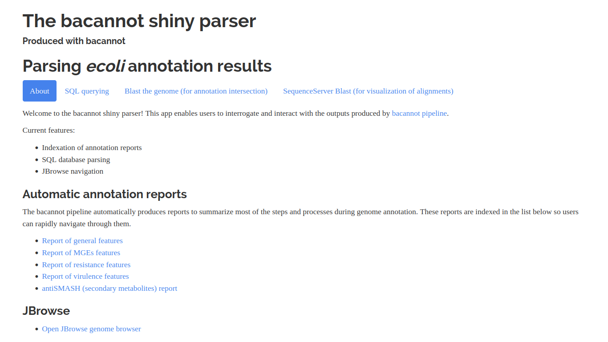

.. _quickstart:

Quickstart
==========

For a rapid and simple quickstart we will use as input the nanopore raw reads provided in the `Canu quickstart section <https://canu.readthedocs.io/en/latest/quick-start.html#assembling-pacbio-clr-or-nanopore-data>`_.

Download the data
-----------------

.. code-block:: bash

  # Download and save as oxford.fasta
  curl -L -o oxford.fasta http://nanopore.s3.climb.ac.uk/MAP006-PCR-1_2D_pass.fasta

Run the pipeline
----------------

For examplification purposes and to get a major overview we will execute the pipeline's major processes:

.. code-block:: bash

  # Run the pipeline using the Escherichia coli resfinder database
  nextflow run fmalmeida/bacannot --prefix ecoli \
  --lreads oxford.fasta \
  --lreads_type nanopore \
  --outdir _ANNOTATION \
  --threads 4 \
  --resfinder_species "Escherichia coli"

Outputs
-------

This command shall write the results under the ``_ANNOTATION`` directory.

.. note::

  Please take note that the pipeline uses the directory set with the ``--outdir`` parameter as a storage place in which it will create a folder named as the
  ``--prefix`` parameter. This ``{prefix}`` folder will contain all the results. Therefore the the same ``--outdir`` can be used for different runs/genomes
  as each one of them will have a different sub-folder. This is useful and required for the genomic comparative pipeline (that is under construction) that will
  use this folder as input, and enable the user to rapidly compare the results between the samples under the same ``--outdir`` folder.

Directory tree
^^^^^^^^^^^^^^

After a successful execution, you will have something like this:

.. code-block:: bash

    # Directory tree from the running dir
    .
    ├── _ANNOTATION
    │   └── ecoli
    │       ├── ICEs                                            # Results from ICEberg database annotation
    │       ├── KOfamscan                                       # Results from annotation with KEGG database
    │       ├── MLST                                            # MLST results with mlst pipeline
    │       ├── annotation                                      # Prokka annotation files
    │       ├── assembly                                        # Assembly files (when raw reads are given)
    │       ├── gbk                                             # Gbk file produced from the resulting GFF
    │       ├── genomic_islands                                 # Genomic Islands predicted with IslandPath-DIMOB
    │       ├── gffs                                            # A copy of the main GFF files produced during the annotation
    │       ├── jbrowse                                         # The files that set up the JBrowse genome browser
    │       ├── plasmids                                        # Plasmid annotation results from Platon and Plasmidfinder
    │       ├── prophages                                       # Prophage annotation results from PhiSpy, Phigaro and PHAST
    │       ├── rRNA                                            # barrnap annotation results
    │       ├── report_files                                    # Annotation reports in HTML format
    │       ├── resistance                                      # AMR annotation results from ARGminer, AMRFinderPlus, RGI and Resfinder
    │       ├── sqldb                                           # The sqlDB of the annotation used by the shiny server for rapid parsing
    │       ├── tools_versioning                                # Versions of tools and databases used (whenever available)
    │       ├── virulence                                       # Virulence genes annotation results from Victors and VFDB databases
    │       └── run_server.sh                                   # The shiny parser runner that enables a rapid and simple exploration of the results (see below)
    └── oxford.fasta

Bacannot shiny parser
^^^^^^^^^^^^^^^^^^^^^

The bacannot shiny server is basically a wrapper of the main outputs of the pipeline that is packed up in a docker image called ``fmalmeida/bacannot:server``.
This server is triggered by going under the results folder, in our quickstart case, the ``_ANNOTATION/ecoli`` folder, and run the command:

.. code-block:: bash

  # Trigger the server
  ./run_server.sh -s

  # This will open the pipeline in localhost:3838
  # log message:
  The server has started in: http://localhost:3838/
  When finished, run the command:
	       docker rm -f {docker container id}

  # To stop the server you just need to execute
  docker rm -f {docker container id}

Server homepage
"""""""""""""""

In the first page it has indexed as url links the main HTML reports and the JBrowse genome browser (Figure 1).

1. In the second page, the sqlDB is used to provide a rapid and simple way to query and filter the genome annotation (Figure 2).
2. In the last page, the server provides a simple way to BLAST the genome with new gene queries and to automatically identify intersections
between the blast results and the the main annotation (Figure 3).
